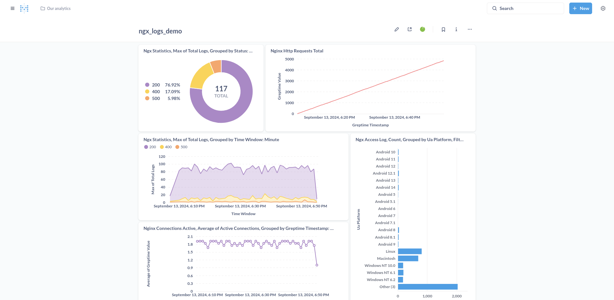

# GreptimeDB Metabase Driver


This is a [GreptimeDB](https://github.com/greptimeteam/greptimedb) community
driver plugin for [Metabase](https://metabase.com), an open source BI tool.



## Installation

Download pre-compile jar package from [the release
page](https://github.com/greptimeteam/greptimedb-metabase-driver/releases/latest/)
and place it in `plugins/` in the same path with your `metabase.jar`
file. Metabase will automatically load this plugin on startup.

## Pre-built Metabase Image

We create open source Metabase docker images with this plugin included for each
GreptimeDB driver plugin release.

```
docker pull greptime/metabase-greptimedb:latest
docker run -p 3000:3000 greptime/metabase-greptimedb:latest
```

## Build

To build this project, you need to get [codebase of
metabase](https://github.com/metabase/metabase) and install Clojure CLI tool.

```bash
export DRIVER_PATH="/absolute/path/to/this/driver"

cd "/metabase/code/path"

clojure \
  -Sdeps "{:aliases {:greptimedb {:extra-deps {com.metabase/greptimedb-driver {:local/root \"$DRIVER_PATH\"}}}}}"  \
  -X:build:greptimedb \
  build-drivers.build-driver/build-driver! \
  "{:driver :greptimedb, :project-dir \"$DRIVER_PATH\", :target-dir \"$DRIVER_PATH/target\"}"
```
